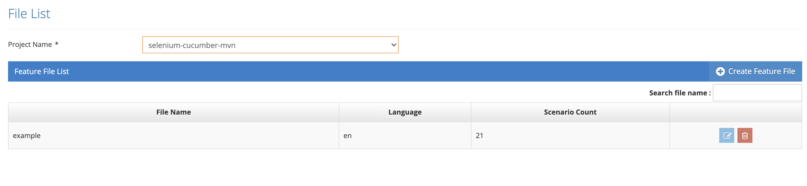

# BDD Editor

It is the screen where the features are listed according to the projects. According to the selected project, feature names, language and scenario numbers are displayed on the screen.

