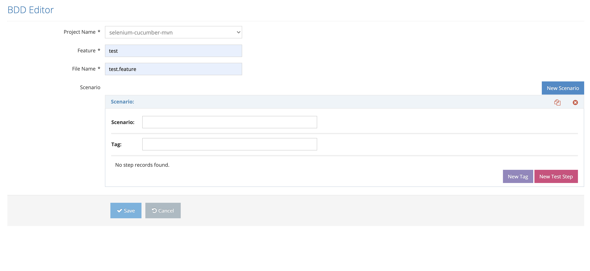

# Create Concept File

On this screen, scenarios can be created for the test steps according to the selected project.

On the screen that opens;&#x20;

1\. Project Name&#x20;

2\. Feature File Name&#x20;

3\. Scenario&#x20;

These values are entered and the Save button is clicked. The system saves it to the system with the new scenario value. If the Cancel button is pressed, the system cancels the identification process.&#x20;
