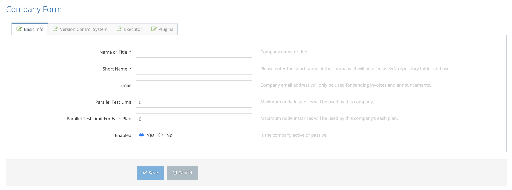
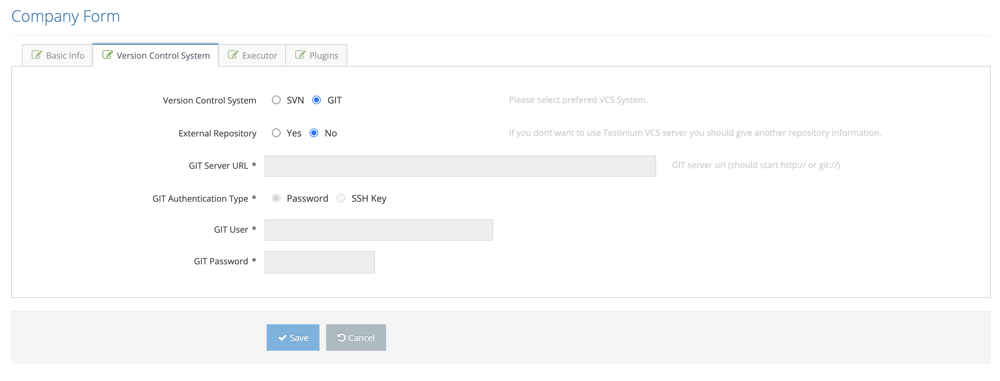
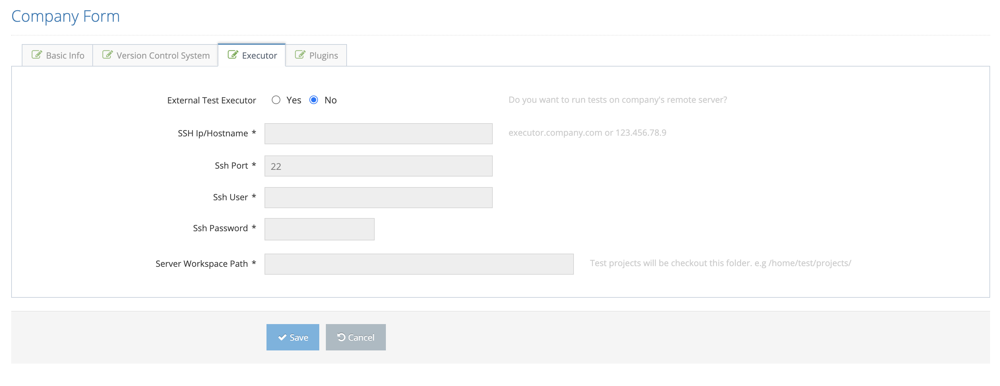
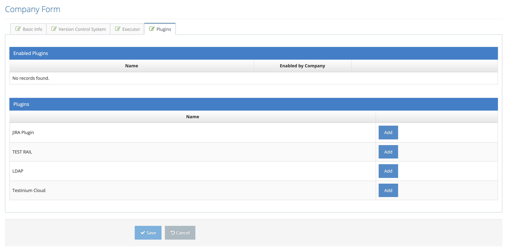

# Create New Company

It is the screen where a new company definition is made in the system.

On the pop-up Basic Info screen;&#x20;

1. Name or Title &#x20;
2. Short Name &#x20;
3. Email&#x20;
4. Parallel Test Limit&#x20;
5. Enabled  &#x20;

These values are entered and the Version Control System tab is clicked.  System displays the Version Control System screen. On this screen, information that is necessary to connect to the customer's version control system are entered.&#x20;

On the pop-up Version Control System screen;&#x20;

1. Version Control System&#x20;
2. External Repository (If an external server is desired, Yes should be selected)&#x20;
3. GIT Server URL &#x20;
4. GIT User &#x20;
5. GIT Password &#x20;

values are entered and the Executor tab is clicked. The system displays the Executor screen.&#x20;

On the pop-up Executor screen;&#x20;

1. External Test Executor (If an external test server use is desired, Yes should be selected)&#x20;
2. SSH Ip / Hostname &#x20;
3. SSH Port&#x20;
4. SSH User &#x20;
5. SSH Password &#x20;
6. Server Workspace Path &#x20;

values are entered and the Plugins tab is clicked. The system displays the Plugins screen.&#x20;

On the pop-up Plugins screen ; The existing plugins are listed in the Plugins list. By clicking the Add button, this plugin is added to the Enabled Plugins section.&#x20;

&#x20;

This added plugin can be disabled with the Disable button. It is removed from the enabled plugins list with the Remove button.&#x20;

&#x20;

After the values in all tabs are entered, the system admin clicks the Save button. The system saves the new company definition.&#x20;

&#x20;

If the Cancel button is pressed, the system cancels the process of adding a new company.

