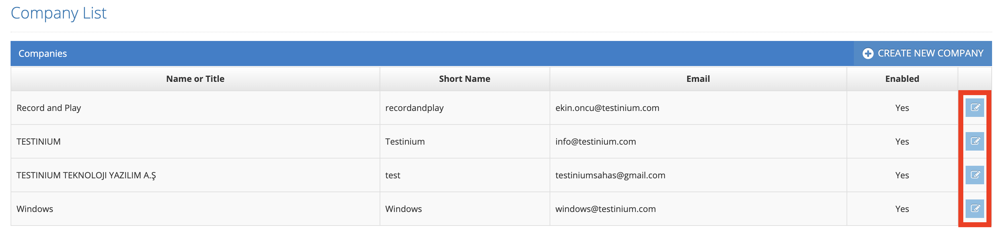

# Edit Company

All defined companies are listed on the listing screen. The icons on the right are the Update buttons.&#x20;

&#x20;

Click the Update icon for the record that is wanted to be updated from the list. System displays Basic Knowledge, Version Control System, Coach, Additions tabs. System Admin changes the field that it wants to update at each step and clicks the Save button. System information is updated.&#x20;

&#x20;

If the System admin wants to cancel the update process, it clicks the Cancel button.&#x20;
