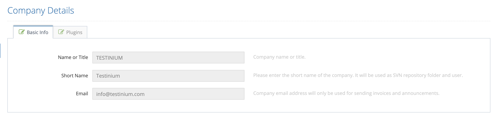
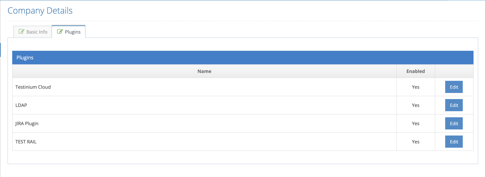

# Company Details

Company information that can be seen by company users logged into the system. The Company Officer clicks on the Company Details menu and the system first demonstrates the Basic Info tab below.

Click on the Plugins tab to change or add the Company Official plugins. In this tab, the plug-ins that are defined for the company are listed.

Click on the Plugins tab to change or add the Company Official plugins. In this tab, the plug-ins that are defined for the company are listed.

