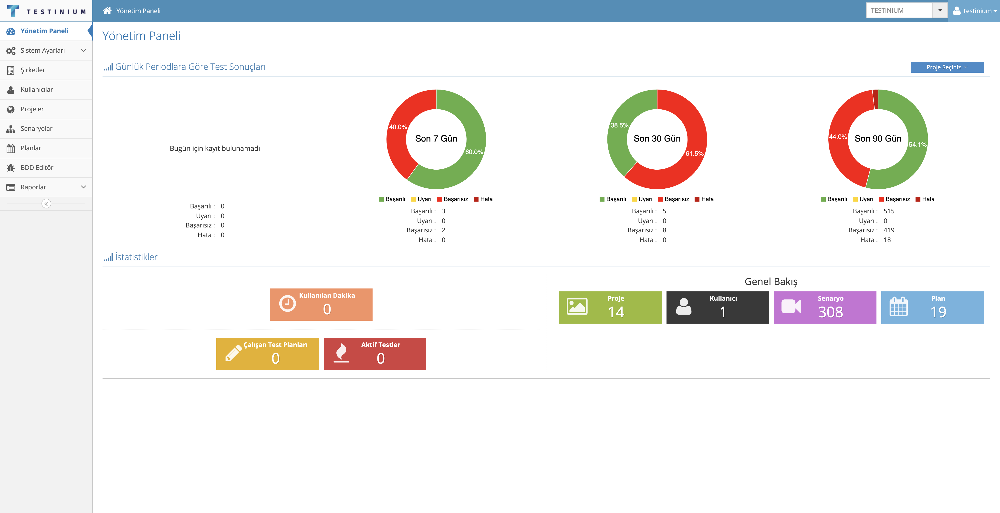

# Dashboard

If the Dashboard is analyzed from top to bottom; At the top, there is the company and user information. This field is visible to admin users.&#x20;

&#x20;

In the Select Project field, the project list that is opened on company basis is demonstrated.&#x20;

&#x20;

The system shows the test result graphs of all projects in the first place (Test Results by Daily Period). If there is only one project in the system, the system displays its result graphics. For projects that are defined more than one, the result graphics of the project can be displayed by selecting it from the Select Project section. Minute Usage in the Statistics section shows the total of IOS, Windows, Mac, Linux, Android usage. It displays the usage rate and billing information on a per-minute basis from the links below.&#x20;

&#x20;

The Quick Overview section shows how many plans, projects, users, scenarios and requests there are.&#x20;

&#x20;

In the Active Tests section, the currently running test scenarios are included. The test can be stopped with the stop button. The Refresh button is used to keep the list up-to-date.&#x20;

&#x20;

Running plans are listed in the Running Test Plans section. The test can be stopped with the Stop button.&#x20;

&#x20;

