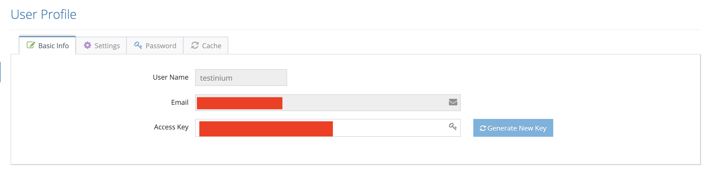
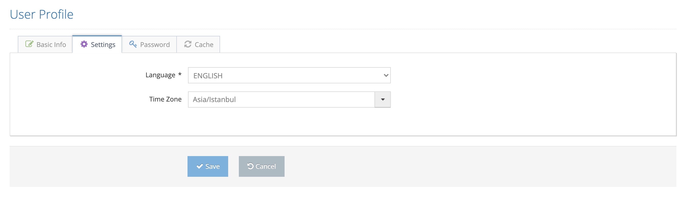
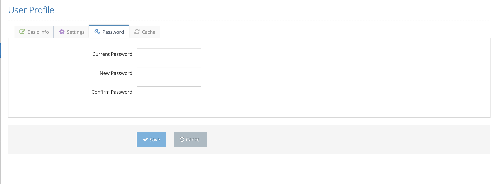

# User Profile

The profile information of the user logged into the system can be viewed and changed here. The authorized user clicks on the User Profile menu and the system first displays the Basic Info tab below.

On thePop-up Basic Info screen;&#x20;

1. User Name&#x20;
2. Email&#x20;
3. Access Key&#x20;

Only the Access Key value can be changed from these values, and for this, the Generate New Key button is pressed. After the change, the Save button is clicked and the data is saved.&#x20;

&#x20;

Click the Settings tab to change the user language and time zone settings.&#x20;

&#x20;

There are Turkish and English options available. The user can choose one of them s/he wants.&#x20;

On the Pop-up Settings screen;&#x20;

&#x20;

1. Language&#x20;
2. Time Zone&#x20;

&#x20;

The values are changed and the Save button is pressed. With the language change, the interface language settings have also been changed, and English screens are displayed in Turkish.&#x20;

Click the Password tab to change the user password.&#x20;

On the Pop-Up Password screen;&#x20;

1. Current Password&#x20;
2. New Password&#x20;
3. Confirm Password&#x20;
4. Save&#x20;

