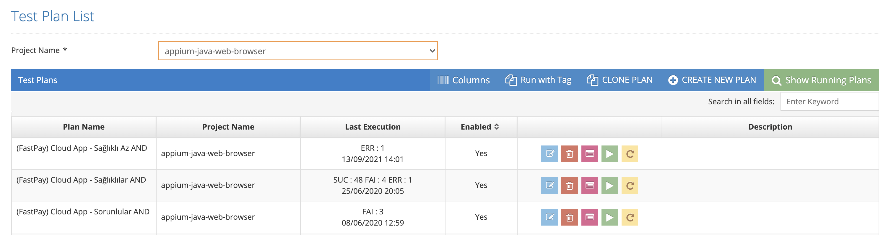

# Plans

Testinium > Plans

Under the Columns button, there exists Created By, Created At, Updated By and Updated At options. It is added by selecting the desired options.

Under the Columns button, there exists Created By, Created At, Updated By and Updated At options. It is added by selecting the desired options.
