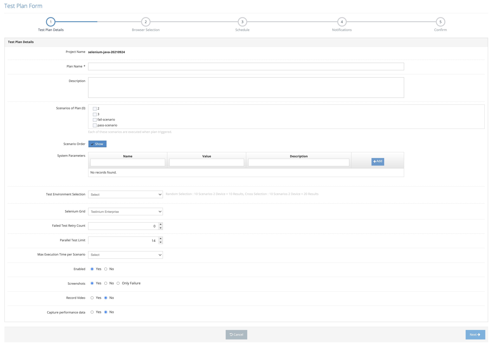
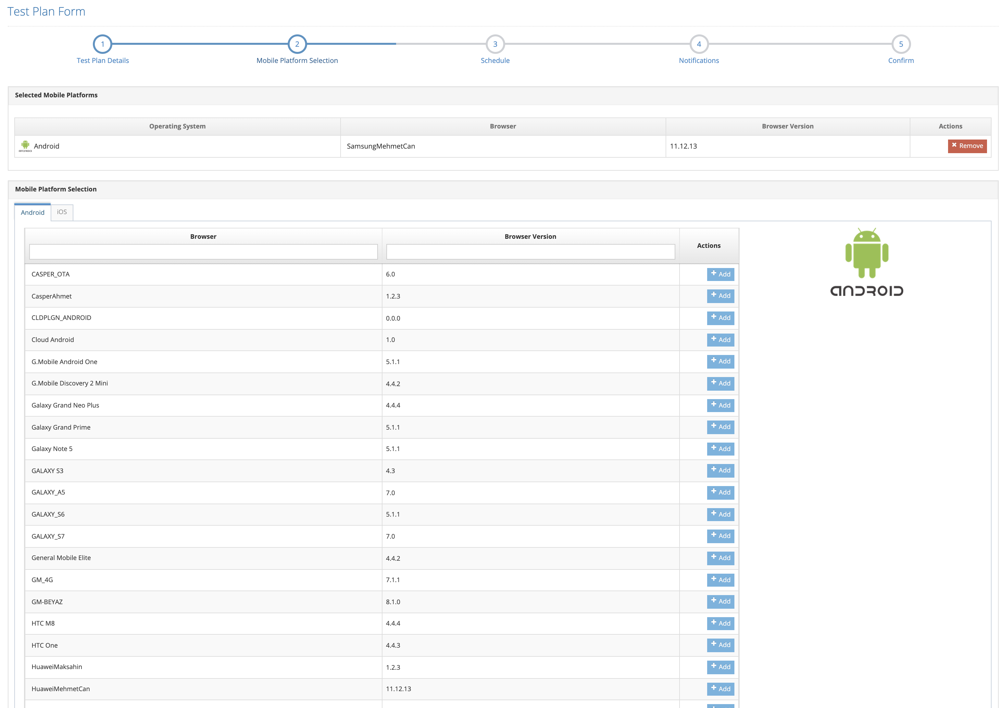
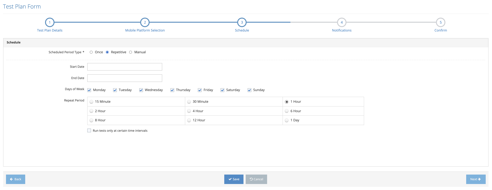
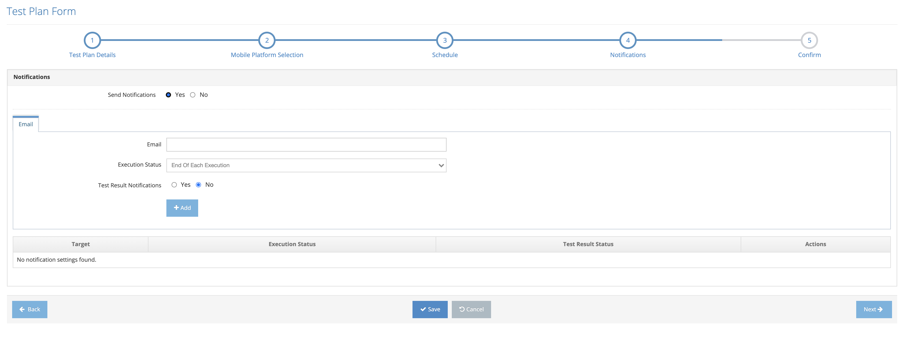
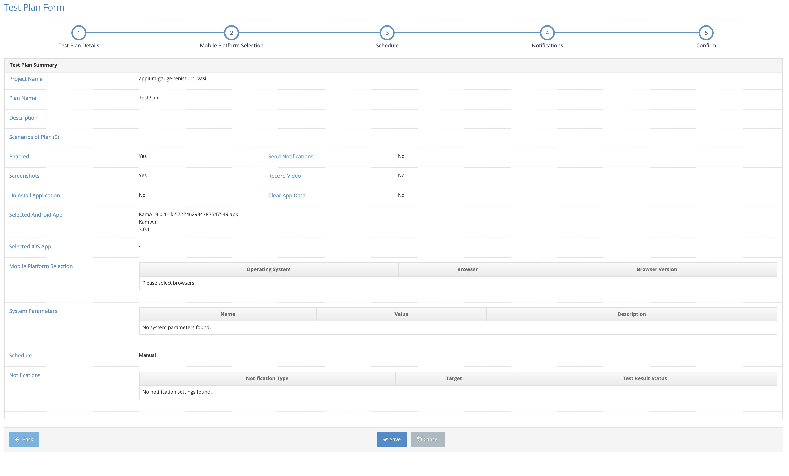

# Create Plan

It is the screen where a new plan definition is made in the system. Before creating a new plan, it is mandatory to select Project Name from the homepage. If the Create a new plan button is clicked without selecting the Project Name, the system displays the error message regarding the selection of the project name. &#x20;

The system displays the first Test Plan Details tab.&#x20;

On the screen that opens;&#x20;

1. Project Name &#x20;
2. Plan Name &#x20;
3. Description &#x20;
4. Scenarios of Plan &#x20;
5. Add Parameters / Java Test Parameters &#x20;
6. Selenium Grid (The environment where the tests will run, Enterprise or Cloud)&#x20;
7. Failed Test Retry Count (Number of Repetitions on Test Fail)&#x20;
8. Parallel Test Limit &#x20;
9. Max Execution Time per Scenario &#x20;
10. Enabled &#x20;
11. Screenshots &#x20;
12. Record Video &#x20;
13. Capture Performans Data (Displayed in browser tests, not in mobile tests. Reports values such as screens on time)&#x20;
14. Group Test Plan (If one of the two Mobile Devices is the Receiver and the Other is the Sender, the group is defined as the plan and the Receiver/Sender is defined as the parameter in the Plan.)&#x20;
15. Clear App Data&#x20;
16. Fetch File From Device (In mobile tests, the directory of the log file is given where the log file is almost.&#x20;

These values are entered and the Next button is clicked. The system displays the Mobile Platform Selection screen. If Cancel is clicked, the system cancels the process of adding a new plan.&#x20;

&#x20;

Clicking the Add Parameters button, the system displays the Java Test Parameters field.&#x20;

.png>)

1. Name &#x20;
2. Value &#x20;
3. Description &#x20;

Data is entered in the fields and the Add button is clicked. Added values can be updated and deleted. These values are general parameters for the test code. They are not parameters entered for the screen.&#x20;

On the Mobile Platform Selection screen that opens;&#x20;

1. Browser&#x20;
2. Browser Version &#x20;

The desired mobile is found from the fields and these selections are added to the Selected Mobile Platform section by clicking the Add button.&#x20;

Click the Next button and go to the Schedule tab.&#x20;

If the Back button is clicked, it will be directed to the Test Plan Details tab.&#x20;

If the Cancel button is clicked, the system cancels the plan definition process.&#x20;

If it is a one-time test plan, the Start Date is entered in the Once option.&#x20;

If a repetitive test plan is desired, click on the Repetitive tab and on the screen that opens,&#x20;

1. Start Date &#x20;
2. Finished Date &#x20;
3. Days of Week &#x20;
4. Repeat Period &#x20;

&#x20;

These values are entered in the form field.&#x20;

Click the Next button and proceed to the Notifications tab.&#x20;

If the Back button is clicked, it will be directed to the Schedule tab.&#x20;

If the Cancel button is clicked, the system cancels the plan definition process.&#x20;

The system displays the Notifications tab.&#x20;

On the screen that opens;&#x20;

&#x20;

1. Send Notification &#x20;
2. E-mail &#x20;
3. Execution Status &#x20;
4. Test Result Notification &#x20;
5. Test Result Status &#x20;

&#x20;

These values are entered and the Add button is clicked. The system displays the added record on the listing screen. This added record can be removed with the Remove button.&#x20;

Click the Next button and proceed to the Confirm tab.&#x20;

If the Back button is clicked, it will be directed to the Notifications tab.&#x20;

If the Cancel button is clicked, the system cancels the plan definition process.&#x20;

&#x20;

On the Confirm screen that opens, the system displays a summary of all the information in the previously entered tabs.&#x20;

&#x20;

The system admin clicks the Save button. The system saves the new plan definition.&#x20;

If the Back button is clicked, it will be directed to the Notifications tab.&#x20;

If the Cancel button is pressed, the system cancels the new plan definition process. &#x20;
