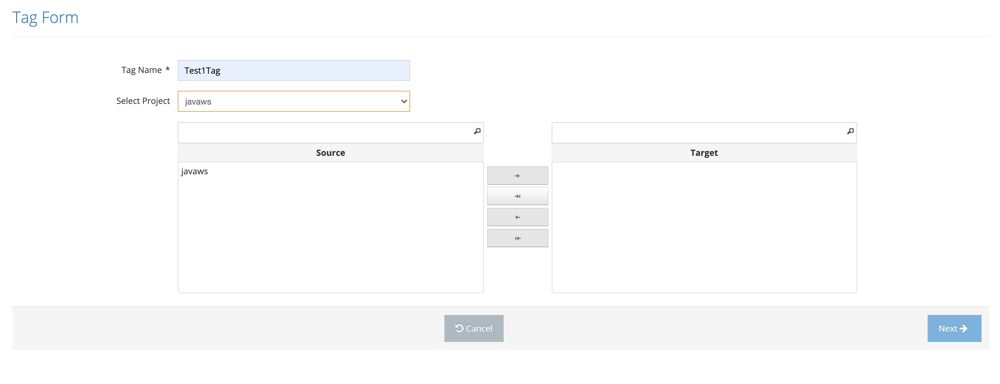

# New Tag

On the tag list page, the New Tag button is clicked. After the Tag Name is determined and the company is selected, the plans are seen in the Source field. If the desired plans are to be Schedule after they are moved to the Target area, the time is specified on the schedule page by clicking the Next button, or the process is completed by clicking the Save button.

