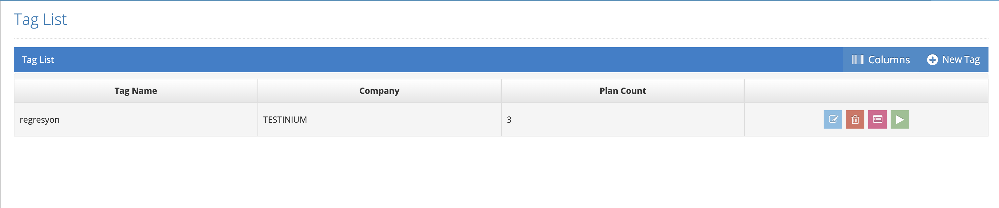

# Run with Tag

Used to run by grouping plans. By clicking the Run with Tag button on the plan page, the Tag List page is accessed.

The run is started by clicking the run button next to the tag that you want to run.
