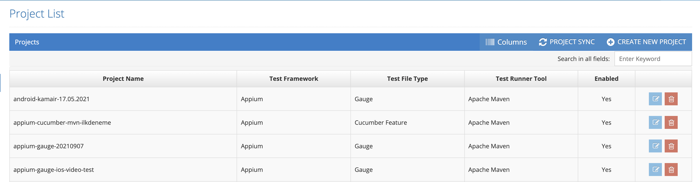
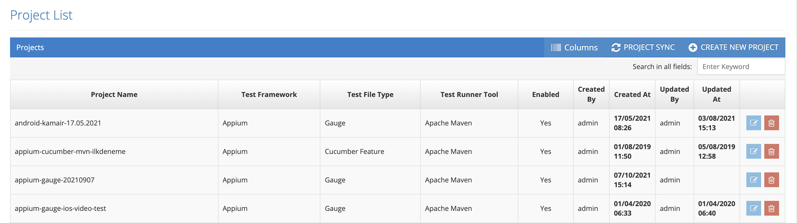

# Projects

In the system, test scenarios are defined depending on a project and run according to the definitions in the project.&#x20;

&#x20;

Projects are defined according to Web / Mobile or Web Service test preference. Each test plan works on a project.&#x20;

&#x20;

Testinium > Projects&#x20;

Under the Columns button, there are Created By, Created At, Updated By and Updated At options. It can be added as a column by selecting any of these options.

