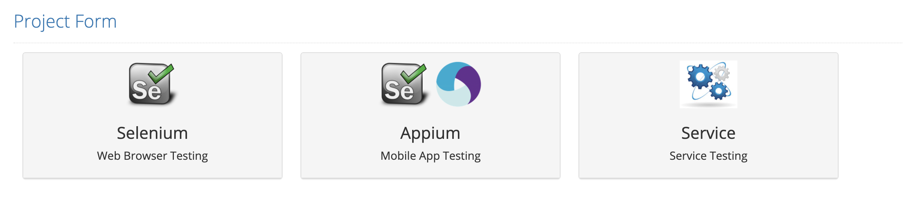
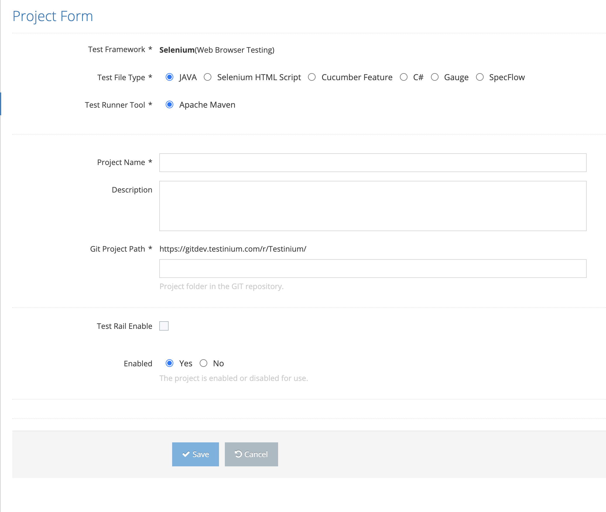
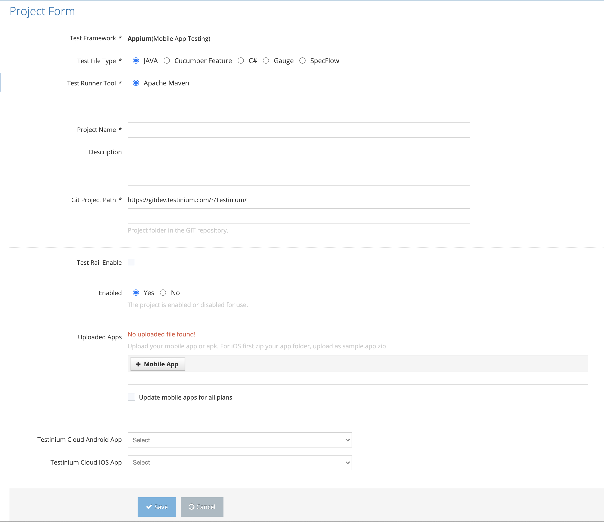

# Create New Project

It is the screen where a new project definition is made in the system. Project definition is made by choosing Selenium if testing will be done only through the web browser, Selenium + Appium is chosen if mobile testing will be performed, and Service is chosen if Web Service testing will be performed.

&#x20;

On pop-up the screen , the system offers three options;&#x20;

1. Selenium&#x20;
2. Selenium + Appium&#x20;
3. Service&#x20;

Click on the icon of the environment that is wanted to be selected.&#x20;

&#x20;

If the choice is Selenium or Service;&#x20;

On the pop-up screen;&#x20;

1. Test Framework &#x20;
2. Test File Type &#x20;
3. Test Runner Tool&#x20;
4. Project Name &#x20;
5. Description&#x20;
6. GIT Project Folder (This is where the test codes are located)&#x20;
7. Enabled  &#x20;

These values are entered and the Save button is clicked. The system saves the new project &#x20;

definition. If the Cancel button is clicked, the system cancels the new Project definition process.&#x20;

If the choice is Selenium + Appium;

On the pop-up screen;&#x20;

1. Test Framework&#x20;
2. Test File Type &#x20;
3. Test Runner Tool &#x20;
4. Project Name &#x20;
5. Description&#x20;
6. GIT Project Folder&#x20;
7. Enabled&#x20;
8. IOS Mobile App&#x20;
9. Android Mobile App
10. Testinium Cloud Android App
11. Testinium Cloud IOS App

These values are entered and the Save button is clicked. The system saves the new project definition. If the Cancel button is clicked, the system cancels the new project definition process.

&#x20;
