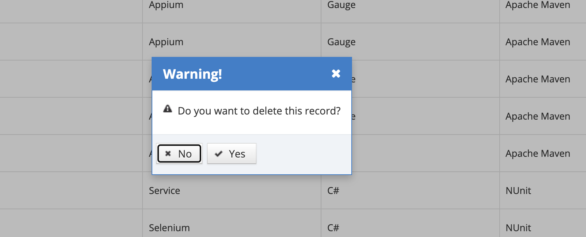

# Delete Project

Exceptions defined in the system can be deleted. Click on the Delete icon for the record to be deleted from the listing screen.

In the pop-up that appears, the Yes button is pressed in response to the question "Are you sure you want to delete this record?". If the No button is pressed, the system cancels the deletion process.
