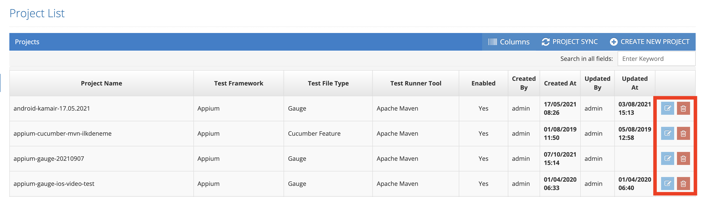
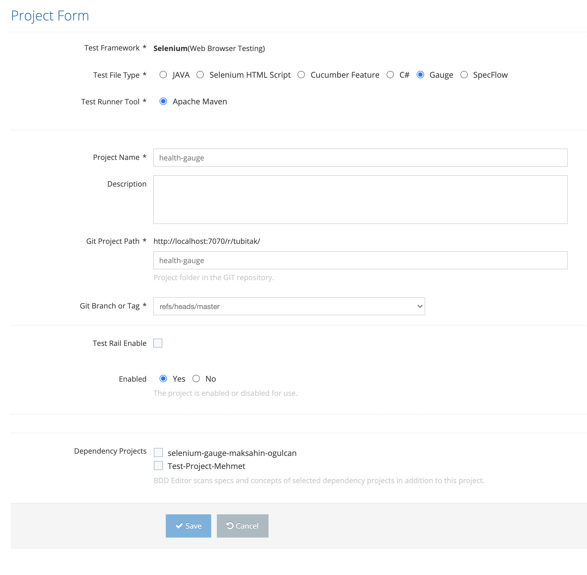
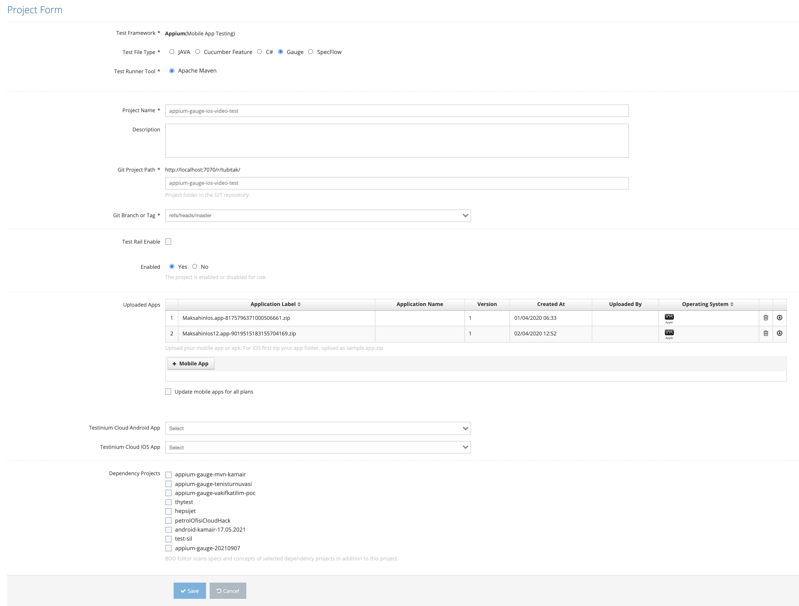

# Edit Project

All defined users are listed on the listing screen. The last two icons in the list area are for Update and Delete.

User should click the Update icon for the record you want to update from the list.

User should click the Update icon for the record you want to update from the list.&#x20;

If you want to update a record with Test Framework selection Selenium or Service;&#x20;

On the screen that opens;&#x20;

&#x20;

1. Test Framework &#x20;
2. Test File Type &#x20;
3. Test Runner Tool &#x20;
4. Project Name &#x20;
5. Description &#x20;
6. GIT Project Folder &#x20;
7. Edit Jira Setting &#x20;
8. Enabled &#x20;

&#x20;

These values are entered and the Save button is clicked. The system updates the selected project definition. If the Cancel button is pressed, the system will cancel the project update process.&#x20;

If you want to update a record with Test Framework selection Selenium + Appium;

On the screen that opens;&#x20;

1. Test Framework &#x20;
2. Test File Type &#x20;
3. Test Runner Tool &#x20;
4. Project Name &#x20;
5. Description &#x20;
6. SVN Project Folder &#x20;
7. Edit Jira Settings &#x20;
8. Enabled &#x20;
9. IOS Mobile App&#x20;
10. Android Mobile App &#x20;

These values are entered and the Save button is clicked. The system performs the project update process. If the Cancel button is pressed, the system cancels the project update process.&#x20;

