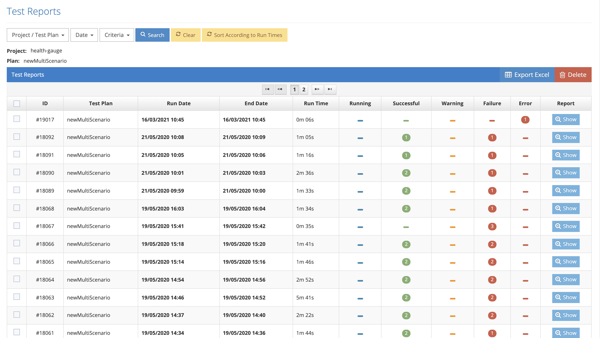

# Test Executions (Auto)

These are the reports that show the result of a plan after it is run completely on the basis of all scenarios and browser/phone.&#x20;

Testinium > Reports > Test Executions&#x20;

