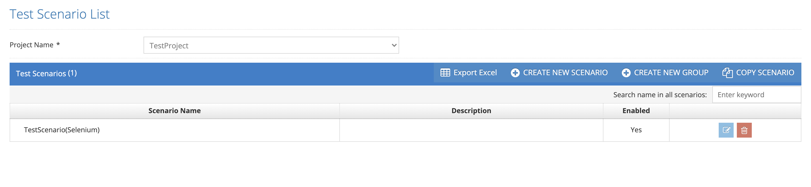

# Scenarios

These are the screens where test scenarios are defined. In these screens, the test stages are entered one by one and the method to be run is selected by connecting to the code written for the test.&#x20;

&#x20;

The purpose of the script is to determine which steps the test will run from which code. Java parameters in the script are required parameters in the test code. They are not the values entered for the test process to run in different parameters.&#x20;

&#x20;

Testinium > Scenarios&#x20;

