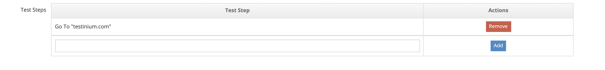
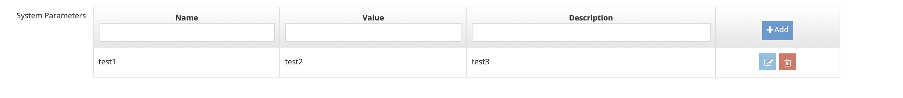

# Create New Scenarios

It is the screen where a new scenario definition is made in the system. Before this process, Project Name must be selected on the listing screen. Otherwise, the system gives an error message that the new scenario operation cannot be performed without selecting a project name. The system also applies filtering on the listing screen according to the selected project name.

.png>)

On the screen that opens; &#x20;

1. Project (t is the Project selected on the listing screen)&#x20;
2. Scenario Name&#x20;
3. Description&#x20;
4. Expected Result&#x20;
5. Test Steps &#x20;
6. Group Name&#x20;
7. Repository URL (Whichever link will be used for the test code, that value is entered.)&#x20;
8. Source File (Which test code to run is selected here.)&#x20;
9. System Parameters (Whichever parameter will be added, those values should be entered.)&#x20;
10. Max Execution Time&#x20;
11. Enabled  &#x20;

These values are entered and the Save button is clicked. The system saves the new scenario value to the system. If the Cancel button is pressed, the system cancels the scenario definition process.&#x20;

&#x20;

In the Test Steps field, the test steps are entered one by one and the Add button is pressed. The system adds them to the list. Added records can be deleted from the list.&#x20;

In the System Parameters field, the relevant values are entered into the buttons one by one, and the Add button is pressed. The system lists the entered values. Added values can be deleted and edited.

