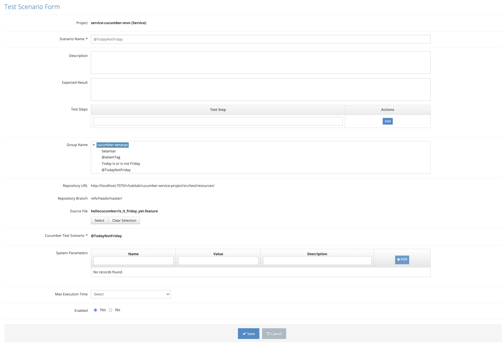

# Edit Scenario

All defined scenarios are listed on the listing screen. The last three icons in the list area are for Add, Update and Delete Subscripts.&#x20;

.png>)

Click the Update icon for the record you want to update from the list.

On the screen that opens;&#x20;

1. Project &#x20;
2. Scenario Name &#x20;
3. Description &#x20;
4. Expected Result &#x20;
5. Test Steps &#x20;
6. Group Name &#x20;
7. Repository URL&#x20;
8. Source File &#x20;
9. System Parameters&#x20;
10. Max Execution Time &#x20;
11. Enabled &#x20;

One or all of its values are changed and the Save button is clicked. The system saves the changed information of the current scenario value to the system. If the Cancel button is pressed, the system cancels the exception update process.&#x20;

&#x20;
