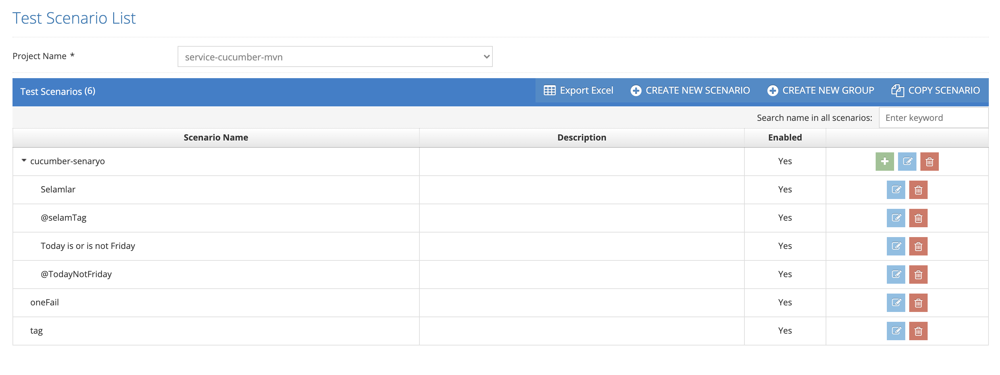
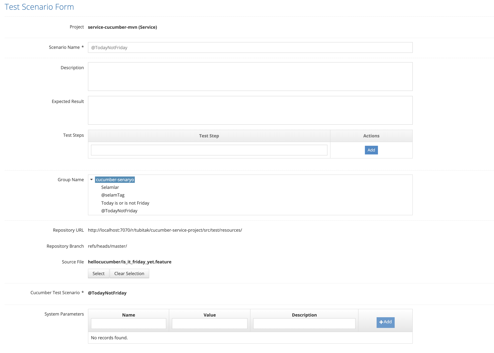

# New Sub Scenario

All defined scenarios are listed on the listing screen. The last three icons in the list area are for Add, Update and Delete Subscripts.

Click on the plus icon in the main scenario where you want to add a sub-scenario from the list. The system automatically selects the main scenario selected in the Parent Scenario section, but if desired, the main scenario can be changed on this screen.

The screen that opens is the same as the main scenario definition screen. Sub-scenario definition is performed by entering the fields displayed on the screen.

