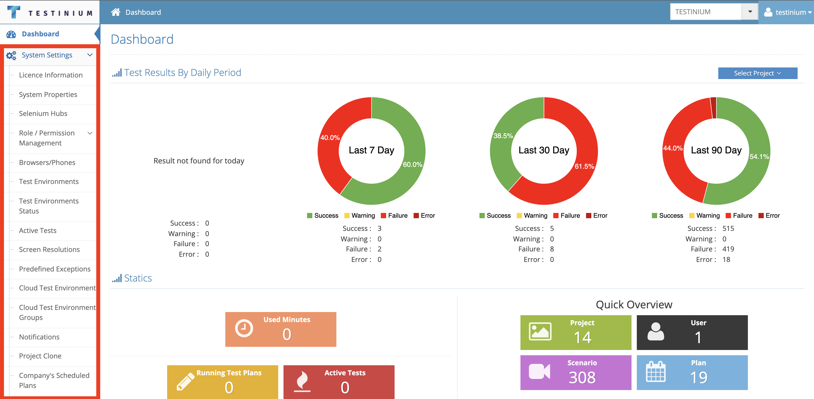

# System Settings

It is the module where all settings related to the system are made. The following definining process are made. These screens can be viewed by Testinium Admin, no client admin/user can see these screens.

* Role/Permission Management&#x20;
* Phone and browser definitions&#x20;
* Test environment definitions&#x20;
* Screen resolution definitions&#x20;
* Predefined exceptional case definitions&#x20;

