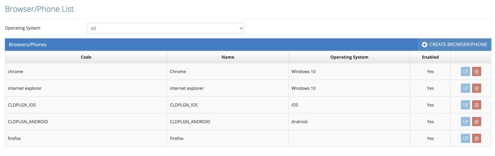

# Browsers / Phones

&#x20;

Which browser and phone models will be used for tests in the system are defined/listed on this screen. This screen and the Browser and Device screens have the same function. Filtering can be done in the listing area according to the operating system that is selected from the Operating System area on the listing screen.&#x20;

&#x20;

Testinium > System Settings > Browser/Phones&#x20;

