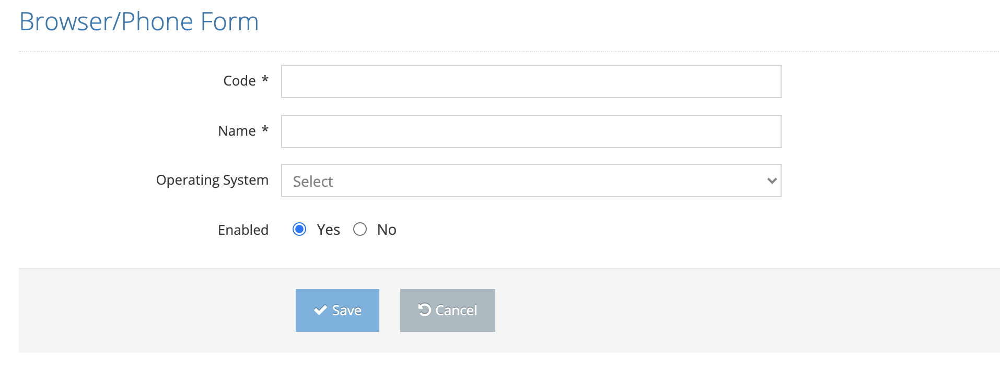

# Create New Phone/Browser

On the pop-up screen;&#x20;

1. Code &#x20;
2. Name&#x20;
3. Operating System &#x20;
4. Enabled &#x20;

These values are entered and the Save button is clicked. The system saves the new browser/phone value to the system. If the Cancel button is clicked, the system cancels the new browser/phone creation operation.&#x20;

&#x20;
