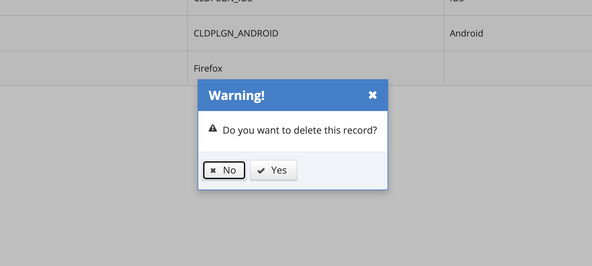

# Delete Browser/Phone

Scanner/phone manufacturers defined in the system can be deleted. Click on the Delete icon for the record to be deleted from the listing screen.&#x20;

&#x20;On the pop-up that appears, the Yes button is click in response to the question "Do you want to delete this record?". If the No button is clicked, the system cancels the deletion process.
