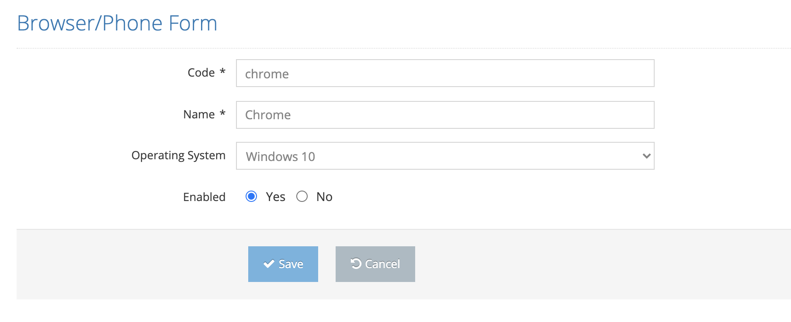

# Edit Phone/Browser

All defined browsers/phones are listed on the listing screen. The last two icons in the list area are for Update and Delete. Click the Update icon for the record you want to update from the list.

On the pop-up screen;&#x20;

&#x20;

1. Code&#x20;
2. Name&#x20;
3. Operating System &#x20;
4. Enabled &#x20;

One, or all, of these values are changed and the Save button is clicked. The system saves the changed information of the current platform value to the system. If the Cancel button is clicked, the system cancels the browser/phone update process.&#x20;
