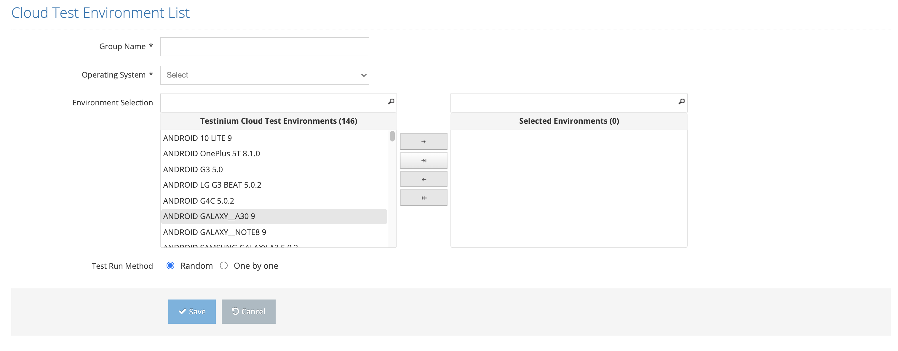

# Creating Cloud Environment Group

This page is accessed by clicking the Create New Group button on the Cloud environment group page. After selecting the group name and operating system, the appropriate environments are listed in the left part of the environment selection area. After the desired environments are selected, the selection is completed with the right key.&#x20;

&#x20;

Test Run Method: It is chosen randomly if it is sufficient to run the test in any of the selected environments. In cases where each test must be run in all environments, the One by one option is selected.&#x20;

&#x20;

After completing the above processes, user should click the Save button to complete the process.

