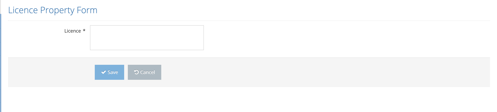

# Add New Licence Key

The License Property Form page is accessed by clicking the Add New License button from the Information (Licence Information) page. Licence Key value is entered here. Save with the Save button, exit without saving with the Cancel button.

