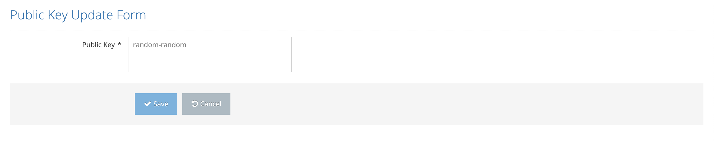

# Update Licence Key

From the edit button next to the option to be updated on the License Information page, the Licence Property Form page is accessed. After the new value is entered, the process is completed by clicking the save button.
