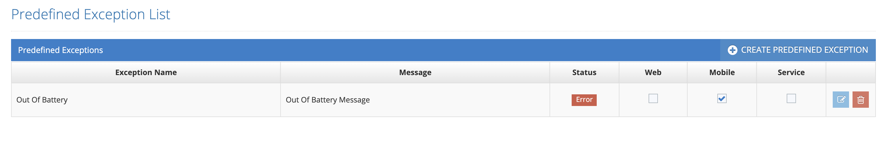

# Predefined Exceptions

This is the screen where the exceptions expected in the system are predefined. These exceptions, defined as Warning/Failed/Error/Succes, are searched in the customer's log file. If the customer has defined xxx.abc.yyException as Error here, the system will detect it as a system error and will not reflect it to the test results. Exceptions specified for failed cases are displayed in the test results. Basically, this definition is for adding values to match the error/fail/success results that need to be known in the log file.&#x20;

&#x20;

Testinium > System Settings > Predefined Exceptions

