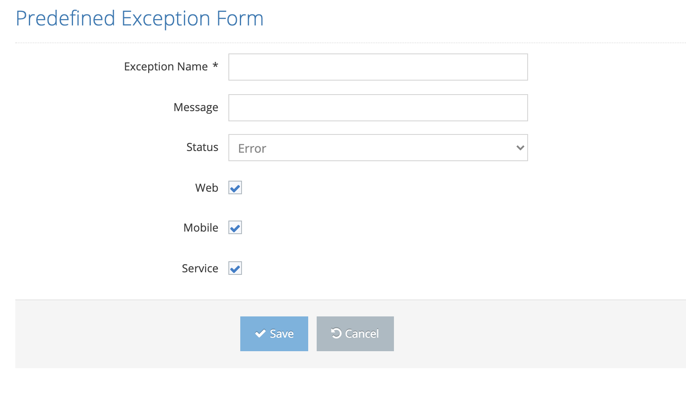

# Create New Predefined Exception

It is the screen where a new exception definition is made in the system. Each defined exceptional value is searched in the customer's log file and evaluated for the test result.

On the pop-up screen;&#x20;

&#x20;

1. Exception Name &#x20;
2. Message to be shown&#x20;
3. Exception Status &#x20;
4. Show on Web &#x20;
5. Show on Mobile &#x20;
6. Show on Service &#x20;

&#x20;

These values are entered and the Save button is clicked. The system saves the new exception value to the system. Click the Cancel button. The system closes the screen without saving the new exception.&#x20;

