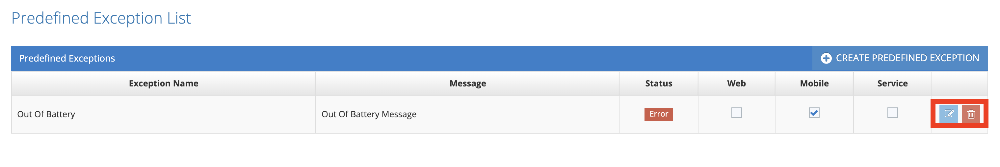

# Edit Predefined Exception

All defined exceptions are listed on the listing screen. The last two icons in the list area are for Update and Delete.&#x20;

&#x20;

Click the Update icon for the record that is wanted to be updated from the list.&#x20;

&#x20;

.png>)

On the pop-up screen;&#x20;

&#x20;

1. Exception Name&#x20;
2. Message to be shown&#x20;
3. Exception Status&#x20;
4. Show on Web &#x20;
5. Show on Mobile &#x20;

&#x20;

One, or all, of these values are changed and the Save button is clicked. The system saves the changed information of the current exception value to the system. If the Cancel button is clicked, the system cancels the exception update process.&#x20;
