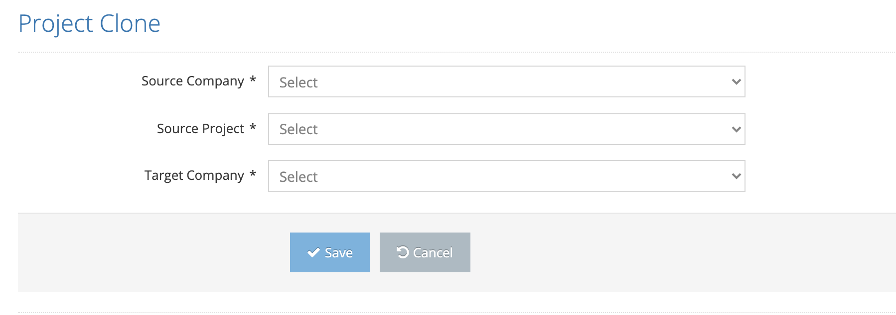

# Project Clone

Copying a project to another company is done on this page.&#x20;

&#x20;

Source Company: The company to which the project that is wanted to be moved belongs&#x20;

Source Project: Project that is wanted to be moved &#x20;

Target Company: The company to which the selected project is wanted to be moved.

After the above fields are filled, the process is completed by clicking the Save button.
