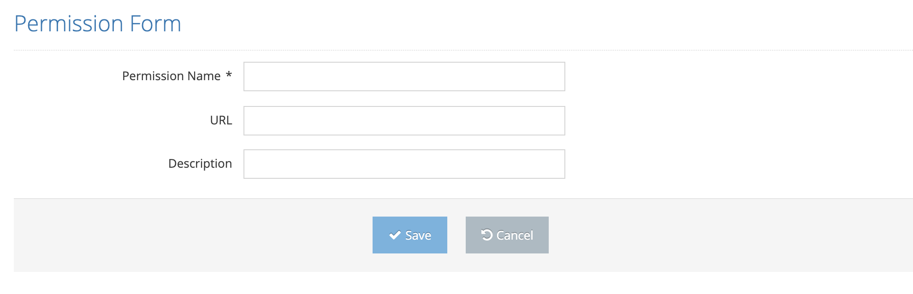

# Create New Permission

These are the screens where a new permission is defined in the system.

On the pop-up screen;&#x20;

&#x20;

1. Permission Name&#x20;
2. URL (Page URL)&#x20;
3. Description&#x20;

These values are entered and the Save button is clicked. The system saves the new permission value to the system. If the Cancel button is clicked, the system cancels the new permission definition process.&#x20;
