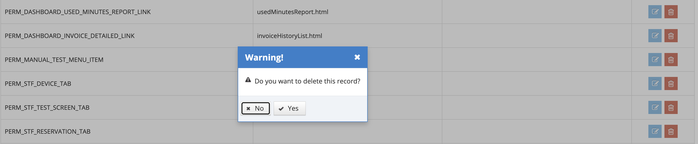

# Delete Permission

&#x20;

The permission that is defined in the system can be deleted, but this is not a highly recommended action. Click on the Delete icon for the record that is wanted to be deleted from the listing screen.&#x20;

