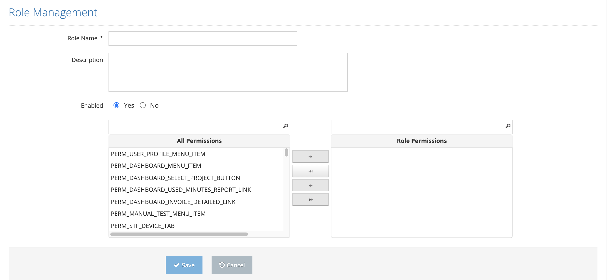

# Create New Role

These are the screens where a new role description is made in the system.

On the pop-up screen;&#x20;

&#x20;

1. Role Name&#x20;
2. Description &#x20;
3. Enabled &#x20;
4. All Permissions / Role Permissions &#x20;

&#x20;

These values are entered and the Save button is clicked. The system saves the new role value to the system. If the Cancel button is clicked, the system cancels the new role definition process.&#x20;
