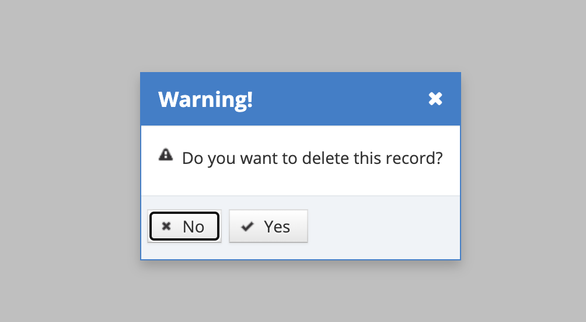

# Delete Role

Roles defined in the system other than the standard 4 roles can be deleted, but this is not a recommended action. If the defined role is assigned to some users, the system will not allow the role to be deleted. Click on the Delete icon for the record that is wanted to be deleted from the listing screen.

On the pop-up that appears, the Yes button is clicked in response to the question "Do you want to delete this record?". If the No button is clicked, the system cancels the deletion process. Permission definition is as follows:
