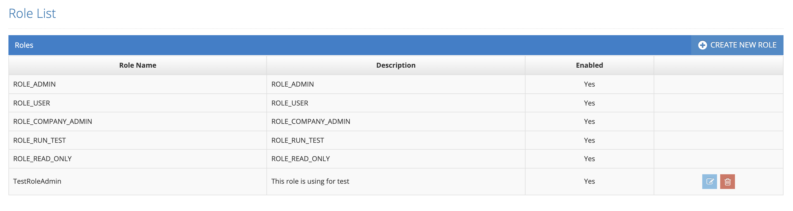
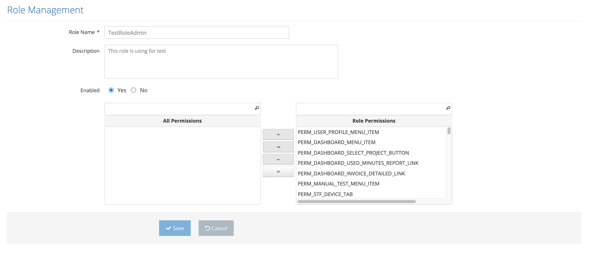

# Edit Role

All defined role descriptions are listed on the listing screen. The last two icons in the list area are for Update and Delete.

All defined role descriptions are listed on the listing screen. The last two icons in the list area are for Update and Delete.&#x20;

On the Pop-Up screen;&#x20;

&#x20;

1. Role Name&#x20;
2. Description &#x20;
3. Enabled &#x20;
4. All Permissions / Role Permissions&#x20;

&#x20;

One or all of these values are changed and the Save button is clicked. The system saves the changed information of the current role value to the system. If the Cancel button is clicked, the system cancels the role update process.&#x20;
