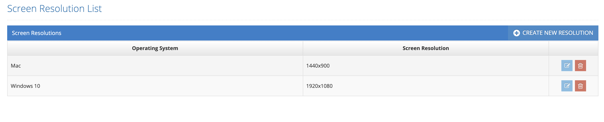

# Screen Resolutions

Operating system based screen resolutions are defined in the system. These defined screen resolutions determine at which resolution the test will be run. While making a Test Plan, it is selected in which operating system and at which resolution the test will be run. The screenshot is also taken by the system at this resolution.&#x20;

&#x20;

Testinium > System Settings > Screen Resolutions&#x20;

