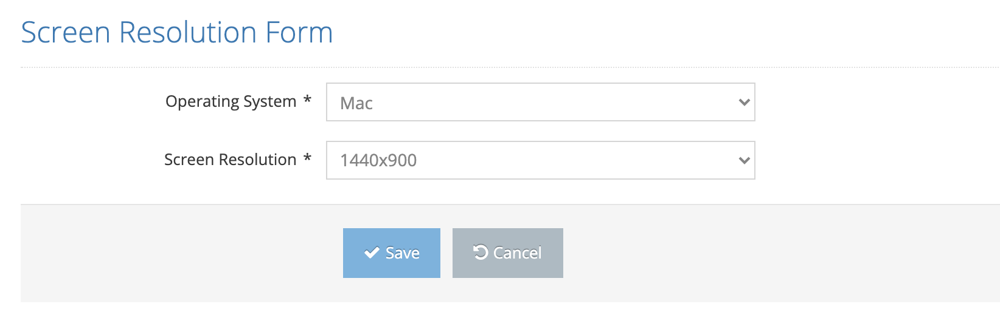

# Create New Screen Resolution

It is the screen where a new screen resolution is defined in the system. 

On the pop-up screen;&#x20;

&#x20;

1. Operating System&#x20;
2. Screen Resolution&#x20;

&#x20;

These values are entered and the Save button is clicked. The system saves the new screen resolution value to the system. If the Cancel button is clicked, the system cancels the new screen resolution defining process.&#x20;
