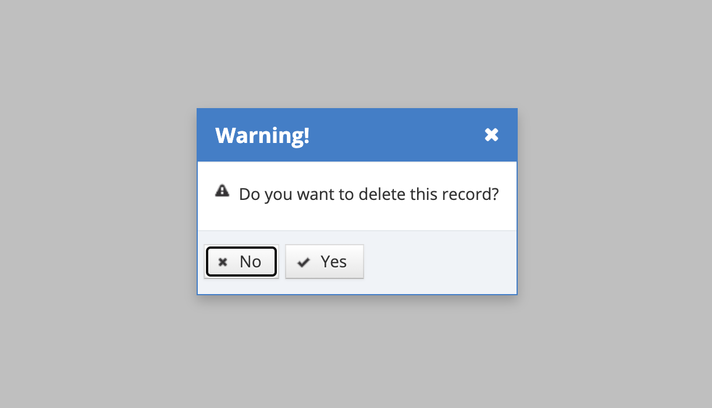

# Delete Screen Resolution

Screen resolution manufacturers defined in the system can be deleted. User should click on the Delete button for the record to be deleted from the listing screen.

On the pop-up that appears, the Yes button is clicked in response to the question "Do you want to delete this record?". If the No button is clicked, the system cancels the deletion process.&#x20;
