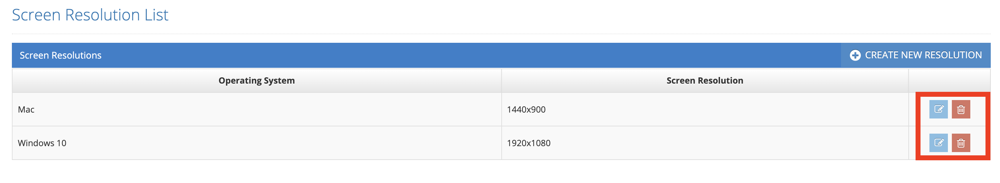
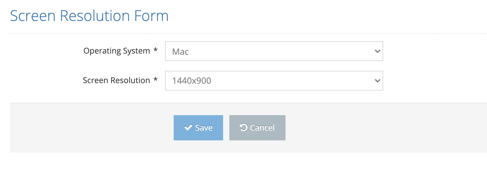

# Edit Screen Resolution

All defined screen resolutions are listed on the listing screen. The last two icons in the list area are for Update and Delete.

Click the Update icon for the record you want to update from the list.

On the pop-up screen;&#x20;

 &#x20;

1. Operating System&#x20;
2. Screen Resolution&#x20;

 &#x20;

One or all of its values are changed and Save saves the changed information to the system.&#x20;

Cancels the cancel operation.&#x20;
