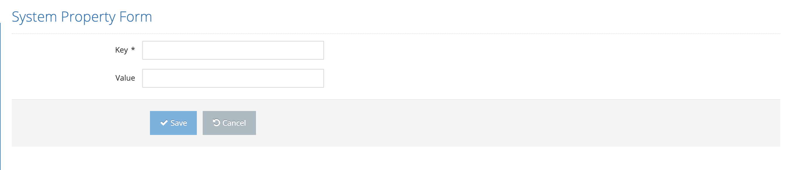

# Creating New System Property

Click the edit button next to the property to be updated on the System Properties page. After entering the Key and Value values, the process is completed by clicking the Save button.

