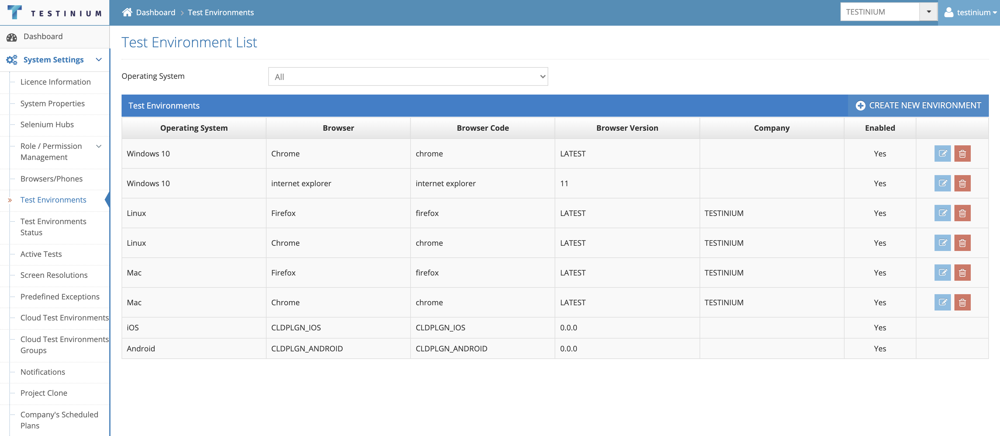

# Test Environments

Which browsers will work on which operating system in the system and Active / Inactive states are determined. The test plan is not run with a deactivated OS/Browser definition.&#x20;

&#x20;

Filtering is applied for the records on the list screen with the Operating System selection on the screen. Records are listed based on the selected operating system type. If no value is selected, the system lists all records.&#x20;

&#x20;

This screen performs the same function as the sum of the Device / Device Model / Device Manufacturer screens.&#x20;

