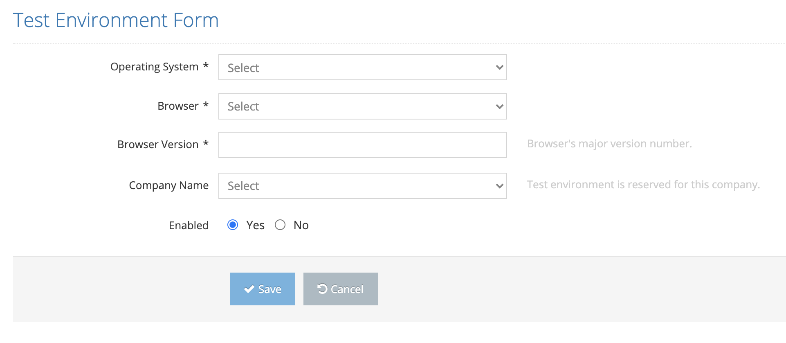

# Create New Environment

It is the screen where a new test environment is defined in the system.

On the pop-up screen;&#x20;

&#x20;

1. Operating Sistem &#x20;
2. Browser&#x20;
3. Browser Version&#x20;
4. Company Name&#x20;
5. Enabled &#x20;

&#x20;

values are entered and the Save button is clicked. The system saves the new device manufacturer value to the system. If the Cancel button is pressed, the system cancels the new test environment definition process.&#x20;
