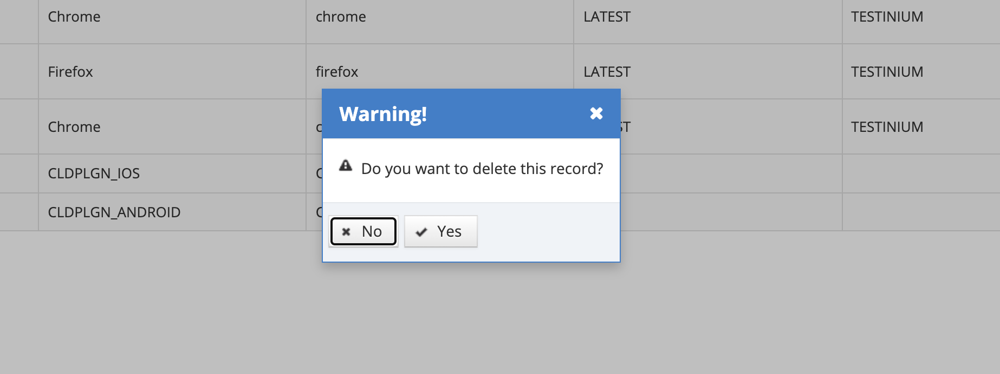

# Delete Environment

Test environments that are defined in the system can be deleted. Click on the Delete icon for the record that is wanted to be deleted from the listing screen.

&#x20;

On the pop-up that appears, the Yes button is clicked in response to the question "Do you want to delete this record?". If the No button is clicked, the system cancels the deletion process.&#x20;
