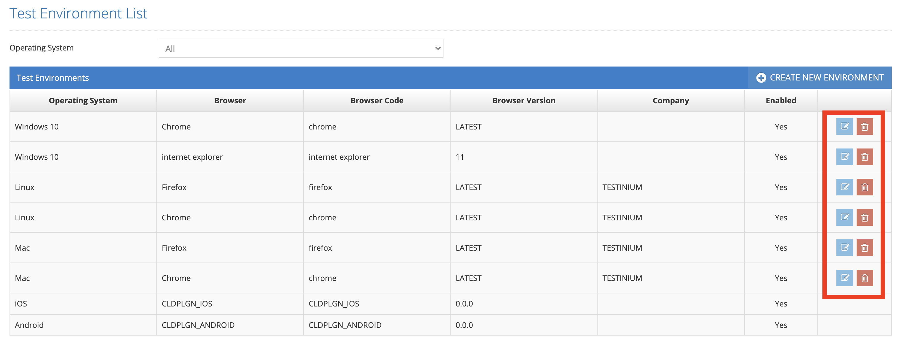
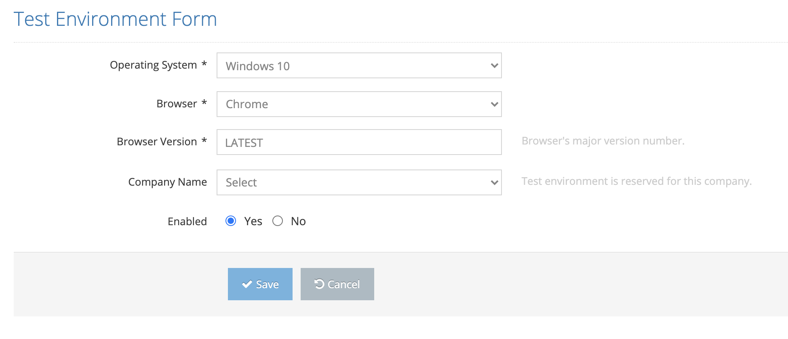

# Edit Enviroment

All defined test environments are listed on the listing screen. The last two icons in the list area are for Update and Delete.&#x20;

On the pop-up screen; &#x20;

&#x20;

1. Operating Sistem  &#x20;
2. Browser &#x20;
3. Browser Version  &#x20;
4. Company Name  &#x20;
5. Enabled&#x20;

&#x20;

One or all of these values are changed and the Save button is clicked. The system saves the changed information of the current test environment value to the system. If the Cancel button is clicked, the system cancels the test environment update process.&#x20;

&#x20;

