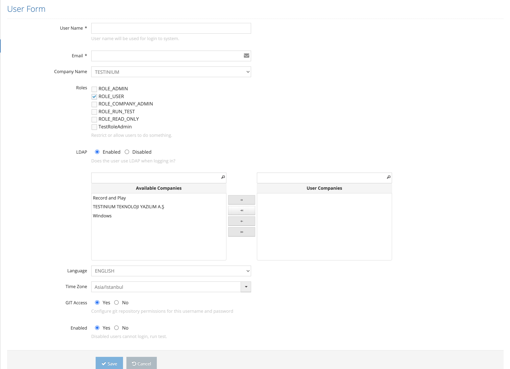

# Create New User

It is the screen where a new user definition is made in the system.

On the pop-up Basic Info screen;&#x20;

1. Username &#x20;
2. Email &#x20;
3. Company Name &#x20;
4. Roles (The user's role on the site is determined here)&#x20;
5. Avaible-User Companies (User can choose company)&#x20;
6. Language &#x20;
7. Timezone &#x20;
8. GIT Access (Provides access to Test Codes)&#x20;
9. Enabled&#x20;

These values are entered and the Save button is clicked. The system saves the new user definition. If the Cancel button is clicked, the system cancels the new user definition process.&#x20;
