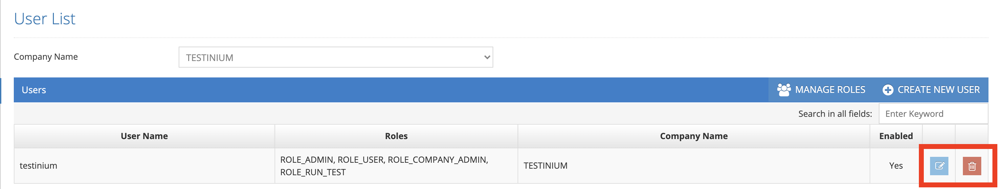
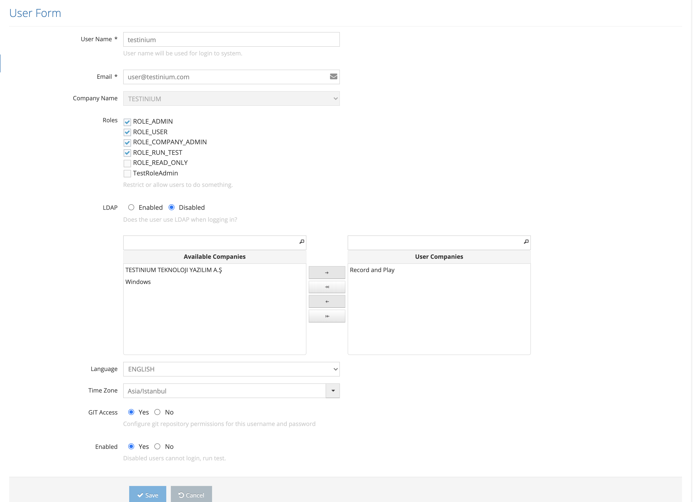

# Edit User

All defined users are listed on the listing screen. The last icon in the list area is for the Update.

Click the Update icon for the record that is wanted to be updated from the list.

On the pop-up screen;&#x20;

1. Username &#x20;
2. Email&#x20;
3. Company Name &#x20;
4. Roles &#x20;
5. Avaible-User Companies&#x20;
6. Language&#x20;
7. Timezone &#x20;
8. GIT Access &#x20;
9. Enabled&#x20;

One, or all, of its values are changed and the Save button saves the changed information to the system.&#x20;
